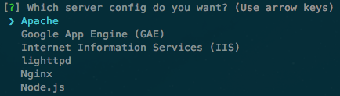

# H5BP Server Configs generator 

Scaffolds out [webserver configuration](https://github.com/h5bp/server-configs) for various platforms. Goes well with HTML5 Boilerplate.

## Getting started

- Make sure you have [yo](https://github.com/yeoman/yo) installed: `npm install -g yo`
- Install the generator locally: `npm install generator-server-configs`
- Run: `yo server-configs`

You can bypass the prompt by specifying the config directly: `yo server-configs node`  
Possible arguments: node, apache, nginx, lighttpd, gae, iis

## License

[MIT License](http://en.wikipedia.org/wiki/MIT_License)
(c) [Sindre Sorhus](http://sindresorhus.com)
